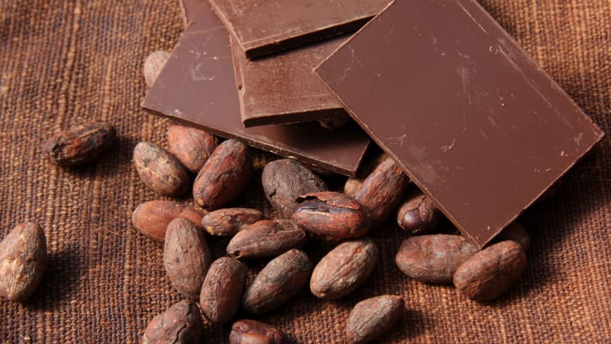
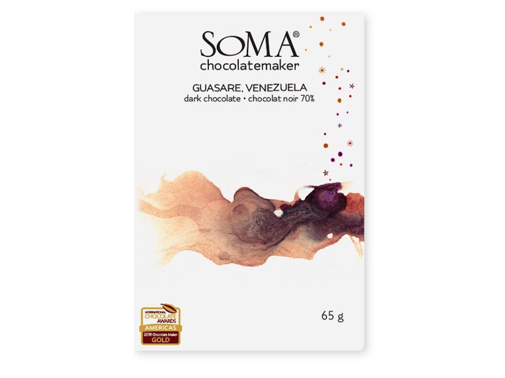

```{r setup, include=FALSE}
knitr::opts_chunk$set(echo = TRUE)
library(tidyverse) #for data cleaning & graphics
library(stringr) #for dealing with strings
library(cowplot) #for merging graphics together nicely
library(wordcloud) #for making cool wordclouds
library(tm) #for text manipulation for the wordcloud
library(RColorBrewer) #for colors
library(grid) #for making grids
library(gridExtra)
```

```{r load dataset, include = FALSE}
#make sure the 'data' and 'images' folders are copied over before trying to run this script
#set the working directory to this source file location 
chocolate <- read.csv("./data/chocolate.csv")
```

# Introduction & Dataset {.tabset .tabset-fade .tabset-pills}

<center>


</center>
<p>
Who doesn't love chocolate? If it is one thing that I hope we can all
agree upon, it is that chocolate can almost always turn a bad day a little sweeter. Most people across the world love chocolate; whether it is a brownie, ice cream, a flavored coffee drink, or
just a basic, plain chocolate bar. In fact, chocolate is so popular, over 5 *billion* units of chocolate candy was sold in the United States alone in 2020 ([source](https://www.statista.com/statistics/643574/unit-sales-candy-and-chocolate-us-by-segment)).

<p>

**Research Questions**

Although I am a chocolate fiend, it can be overwhelming walking into the candy aisle of a grocery store! How do I know which chocolate bar to buy? Which bar will get me the best taste for the least amount of money? So, I've posed some research questions and goals for this exploratory data analysis, overall asking "What makes a good chocolate bar?".

-   Are chocolate bar ratings correlated to the percent of cocoa?
-   Where are the best beans grown?
-   What companies make the best chocolate?
-   How do "blends" compare to single origin?
-   What are the most common first tasting notes?

**Data**

## Original Dataset

I obtained a dataset from the [Flavors of Cacao](http://flavorsofcacao.com/chocolate_database.html) website and database that contains over 2,000 ratings of plain chocolate bars, rated by a chocolate professional.

Here's a glimpse of the raw dataset without any cleaning. As you'll see, I need to do some data cleaning and manipulation on some of the string fields in order to do a proper analysis. I also wanted to classify the ratings into the same 5 categories listed on the Flavors of Cocoa website.

```{r original}
glimpse(chocolate)
```

## Data Cleaning

I ended up having to do a decent amount of text clean-up. I utilized the `mutate()` function quite often which made things easy. The Flavors of Cocoa website also categorizes their ratings into five different buckets, so I added those categories to my dataset as well to run some summaries.

[Strings to Integers]{style="text-decoration:underline"} <br> Originally, the 7 ingredient columns were strings that basically contained `have_ingredient` or `have_not_ingredient`. I decided to change these columns to integers of 1s and 0s so that I could easily summarize and quantify these columns.

[String Manipulation]{style="text-decoration:underline"} <br> I updated some of the country name formatting to look better on my graphics and summaries, and to make sure the country names were consistent across columns `company_location` and `country_of_bean_origin`.

[New Rating Category]{style="text-decoration:underline"} <br> I created
a new `rating_category` field that puts all the chocolate bar ratings
into the 5 buckets described on their website:

-   4.0 - 5.0 = Outstanding
-   3.5 - 3.9 = Highly Recommended
-   3.0 - 3.49 = Recommended
-   2.0 - 2.9 = Disappointing
-   1.0 - 1.9 = Unpleasant

[Factors]{style="text-decoration:underline"} <br> I also set some columns as factors to better group and summarize everything.

```{r data-cleaning}
#change all strings to 0s and 1s
chocolate <- chocolate %>% 
  mutate(cocoa_butter = str_replace_all(cocoa_butter, 
                                pattern = "have_cocoa_butter", replacement = "1")) %>%
  mutate(cocoa_butter = str_replace_all(cocoa_butter, 
                                        pattern = "have_not_cocoa_butter", replacement = "0")) %>%
  mutate(beans = str_replace_all(beans, 
                                        pattern = "have_bean", replacement = "1")) %>%
  mutate(beans = str_replace_all(beans, 
                                        pattern = "have_not_bean", replacement = "0")) %>%
  mutate(vanilla = str_replace_all(vanilla, 
                                        pattern = "have_not_vanila", replacement = "0")) %>%
  mutate(vanilla = str_replace_all(vanilla, 
                                   pattern = "have_vanila", replacement = "1")) %>%
  mutate(lecithin = str_replace_all(lecithin, 
                                   pattern = "have_not_lecithin", replacement = "0")) %>%
  mutate(lecithin = str_replace_all(lecithin, 
                                    pattern = "have_lecithin", replacement = "1")) %>%
  mutate(salt = str_replace_all(salt, 
                                    pattern = "have_not_salt", replacement = "0")) %>%
  mutate(salt = str_replace_all(salt, 
                                pattern = "have_salt", replacement = "1")) %>%
  mutate(sugar = str_replace_all(sugar, 
                                pattern = "have_not_sugar", replacement = "0")) %>%
  mutate(sugar = str_replace_all(sugar, 
                                 pattern = "have_sugar", replacement = "1")) %>%
  mutate(sweetener_without_sugar = str_replace_all(sweetener_without_sugar, 
                                 pattern = "have_not_sweetener_without_sugar", replacement = "0")) %>%
  mutate(sweetener_without_sugar = str_replace_all(sweetener_without_sugar, 
                                                   pattern = "have_sweetener_without_sugar", replacement = "1"))

#set types as integer 
chocolate$cocoa_butter <- as.integer(chocolate$cocoa_butter)
chocolate$beans <- as.integer(chocolate$beans)
chocolate$vanilla <- as.integer(chocolate$vanilla)  
chocolate$lecithin <- as.integer(chocolate$lecithin)
chocolate$salt <- as.integer(chocolate$salt)
chocolate$sugar <- as.integer(chocolate$sugar)
chocolate$sweetener_without_sugar <- as.integer(chocolate$sweetener_without_sugar)

#Update formatting on some of the country names
chocolate$country_of_bean_origin = str_to_title(chocolate$country_of_bean_origin)
chocolate$company_location = str_to_title(chocolate$company_location)

chocolate <- chocolate %>% 
  mutate(company_location = str_replace_all(company_location, pattern = "U.s.a", replacement = "USA")) %>%
  mutate(company_location = str_replace_all(company_location, pattern = "U.k.", replacement = "UK")) %>%
  mutate(country_of_bean_origin = str_replace_all(country_of_bean_origin, pattern = "U.s.a.", replacement = "USA"))

#set things as factors
chocolate$review_date <- as.factor(chocolate$review_date)
chocolate$company <- as.factor(chocolate$company)
chocolate$company_location <- as.factor(chocolate$company_location)

#create new rating category
chocolate$rating_category <- cut(chocolate$rating,
              breaks=c(0, 1.9, 2.9, 3.49, 3.9, 5.0),
              labels=c('Unpleasant', 'Disappointing', 'Recommended', 'Highly Recommended', 'Outstanding'))
```

# Initial Summary {.tabset .tabset-fade .tabset-pills}

This dataset has observations for **`r nrow(chocolate)`** different chocolate bars across **`r ncol(chocolate)`** variables (2 of which are just reference or unique IDs, and 1 of which I calcualted based on an existing rating field). There are **`r length(unique(chocolate$company))`** unique companies, and **`r length(unique(chocolate$country_of_bean_origin))`** different countries that grow beans.

## Countries

The majority of the beans are grown in South America. Venezuela is the highest producer, with **238** different bars using beans from there.

```{r avgBarCountry, message = FALSE}
avgBarCountry <- chocolate %>% count(country_of_bean_origin) %>%
  filter(country_of_bean_origin != "Blend") %>% #i only want to see single origin
  top_n(10, n) %>%
  arrange(desc(n)) 

avgBarCountryPlot <- ggplot(avgBarCountry, aes(reorder(country_of_bean_origin, -n), n))+
  geom_col(fill='darkorange4')+
  labs(title = "Top 10 Cacao Producing Countries",
       subtitle = "Countries producing cacao, ranked by the total number of chocolate bars rated \n(excluding countries with only 1 chocolate bar rating)",
       caption = "Source: Flavors of Cacao")+
  xlab("")+
  ylab("# of Chocolate Bars")+
  theme_classic()+
  scale_x_discrete(guide = guide_axis(angle = 45))+
  scale_y_continuous(expand = c(0,0)) 
avgBarCountryPlot
```

## Companies

"Soma" is the highest producing company, at a total of **52** different bars.

```{r avgBarCompany, message = FALSE}
avgBarCompany <- chocolate %>% count(company) %>%
  top_n(10, n) %>%
  arrange(desc(n)) 

avgBarCompanyPlot <- ggplot(avgBarCompany, aes(reorder(company, -n), n))+
  geom_col(fill='darkorange4')+
  labs(title = "Top 10 Chocolate Bar Companies",
       subtitle = "Companies producing chocolate, ranked by the total number of chocolate bars",
       caption = "Source: Flavors of Cacao")+
  xlab("")+
  ylab("# of Chocolate Bars")+
  theme_classic()+
  scale_x_discrete(guide = guide_axis(angle = 45))+
  scale_y_continuous(expand = c(0,0))
avgBarCompanyPlot
```

<center>

</center>

## Rating Trends

The chocolate bar ratings span from 2006 to 2020 and have an average rating of **`r round(mean(chocolate$rating),1)`** across all years. Looking at the rating histogram, there seems to be a slightly negative skew. And when the ratings are plotted by category, almost 3/4 (72%) of the chocolate bars fall within the website's "Recommended" or "Highly Recommended" ratings.

Looking at the plot of ratings over time, it looks like there's an interesting dip of about
100 ratings in 2017. I wasn't able to figure out why this dip occurred, but I speculate that it could have been due to the rater's personal availability, new chocolate bar availability, etc. A similar dip in reviews also happened in 2020, but I suspect that is very likely due to the COVID-19 pandemic. 


```{r rating trends, message = FALSE}
avgBarYear <- chocolate %>% count(review_date) %>%
  arrange(review_date)

avgBarYearPlot <- ggplot(avgBarYear, aes(review_date, n, group = 1))+
  geom_line(col = 'darkorange4')+
  labs(title = "Reviews Over Time",
       caption = "Source: Flavors of Cacao")+
  xlab("")+
  ylab("Chocolate Bars")+
  theme_classic()+
  scale_x_discrete(guide = guide_axis(angle = 45))+
  scale_y_continuous(expand = c(0,0))

#histogram of chocolate ratings 
rating_hist <- ggplot(chocolate, aes(rating))+
  geom_histogram(bins = 12, fill = "darkorange4", col = "white")+
  labs(title = "Chocolate Bar Ratings Distribution")+
  xlab("")+
  ylab("Chocolate Bars")+
  theme_classic()+
  scale_y_continuous(expand = c(0,0))
  
#summarizing the data by rating category
byCategory <- chocolate %>%
  group_by(rating_category) %>%
  summarize(avgCocoa = mean(cocoa_percent),
            avgIngredients = mean(counts_of_ingredients),
            n = n(),
            perVanilla = sum(vanilla) / n,
            perLecithin = sum(lecithin) / n,
            perSalt = sum(salt) / n,
            perSugar = sum(sugar) / n,
            perSweetener = sum(sweetener_without_sugar) / n)

#plot of showing # of ratings by category
byCategoryPlot <- ggplot(byCategory, aes(rating_category, n))+
  geom_col(fill = "antiquewhite4")+
  ggtitle("Number of bars per rating category")+
  xlab("Flavors of Cacao Rating")+
  ylab("# of Chocolate Bars")+
  theme_classic()+
  scale_y_continuous(expand = c(0,0))

plot_grid(rating_hist, avgBarYearPlot, ncol = 2, align = "h")

byCategoryPlot

print("summary statistics of chocolate bar ratings")
summary(chocolate$rating)

```

## Cocoa Percentages

The distribution of cocoa percentages looks close to being normally distributed with positive kurtosis (a steep curve!). Overall, the average percent of cocoa is **`r round(mean(chocolate$cocoa_percent), 1)`%**. Looking at the percent of cocoa over time, it seems to vary between 70% and 72%, but overall is about the same. When this is plotted in relation to the dataset's minimum and maximum cocoa percentage values, you can hardly discern the difference over year, so there doesn't seem to be any kind of trend here. 

```{r cocoa percentages, message = FALSE}
avgCocoaYear <- chocolate %>% 
  group_by(review_date) %>%
  summarize(n = n(),
            avgCocoa = mean(cocoa_percent)) %>%
  arrange(review_date)

avgCocoaYearPlot <- ggplot(avgCocoaYear, aes(review_date, avgCocoa, group = 1))+
  geom_line(col = "darkorange4")+
  labs(title ="Average Percent of Cocoa Over Time", 
       caption = "Source: Flavors of Cacao")+
  xlab("")+
  ylab("% of Cocoa")+
  theme_classic()+
  ylim(40,100)+
  scale_x_discrete(guide = guide_axis(angle = 45))

cocoa_hist <- ggplot(chocolate, aes(cocoa_percent))+
  geom_histogram(bins = 12, fill = "darkorange4", col = "white")+
  labs(title = "Cocoa Percentage Distribution")+
  xlab("")+
  ylab("# of Chocolate Bars")+
  theme_classic()+
  scale_y_continuous(expand = c(0,0))

plot_grid(cocoa_hist, avgCocoaYearPlot, ncol = 2, align = "h")

print("summary statistics of chocolate bar cocoa percentages")
summary(chocolate$cocoa_percent)
```

# Correlations

I wanted to see if there were any correlations between the chocolate bar
ratings and the percent of cocoa or the number of ingredients.
Surprisingly, it doesn't look like there's a strong relationship between
ratings and cocoa percentage. And maybe less surprising, there is also
no strong relationship between ratings and the number of ingredients.

This means that something else is driving these ratings. Perhaps it is in
the way the beans are processed or roasted? Or maybe it is all based
on the origin (i.e. where the beans are grown).

```{r correlations, message = FALSE}
#any correlation between chocolate rating and cocoa percentage?
rating_cocoa_R2 <- round(cor(chocolate$rating, chocolate$cocoa_percent) ^ 2, 3)
rating_ing_R2 <- round(cor(chocolate$rating, chocolate$counts_of_ingredients) ^ 2, 3)

cocoaCorrPlot <- ggplot(chocolate, aes(cocoa_percent, rating))+ 
  geom_jitter(alpha = 0.5, col = "burlywood3")+
  stat_smooth(method = "lm", col = "darkorange2", se = FALSE)+
  geom_text(aes(50, 1.25, label=paste0("R^2=", rating_cocoa_R2)), check_overlap = TRUE)+
  xlab("Percent of Cocoa")+
  ylab("Rating")+
  theme_classic()
  

ingCorrPlot <- ggplot(chocolate, aes(counts_of_ingredients, rating))+ 
  geom_jitter(alpha = 0.5, col = "burlywood3")+
  stat_smooth(method = "lm", col = "darkorange2", se = FALSE)+
  geom_text(aes(2, 1.25, label=paste0("R^2=", rating_ing_R2)), check_overlap = TRUE)+
  xlab("# of Ingredients")+
  ylab("Rating")+
  theme_classic()

plot_row <- plot_grid(cocoaCorrPlot, ingCorrPlot, ncol = 2, align = "hv")

title <- ggdraw() + draw_label( "Chocolate bar ratings with percent of cocoa and # of ingredients", fontface = 'bold', x = 0, hjust = 0) + theme(plot.margin = margin(0, 0, 0, 7))

plot_grid(title, plot_row, ncol=1, rel_heights = c(0.1,1))
```

# Top Rated Countries

Now to get to the more interesting results. To figure this out, I calculated the average rating by country of bean origin. I then arranged the table in descending order, and filtered the results to just show the top 10 countries.

The small island country of **Sao Tome & Principe** comes in at first place with an average rating of 3.5. However, it looks like this country only has 1 chocolate bar rating. 

Other top countries with > 1 bar rating include the Solomon Islands (which are located in Oceania), Congo, Thailand, and Cuba. All of these countries are pretty hot, humid, and near the equator which is the ideal climate to grow cacao beans.

```{r countrySummary, message = FALSE}
countrySummary <- chocolate %>%
  group_by(country_of_bean_origin) %>%
  summarize(n = n(),
            avgRating = mean(rating),
            maxRating = max(rating),
            avgCocoa = mean(cocoa_percent),
            avgIngredients = mean(counts_of_ingredients),
            perVanilla = sum(vanilla) / n * 100,
            perLecithin = sum(lecithin) / n * 100,
            perSalt = sum(salt) / n * 100,
            perSugar = sum(sugar) / n * 100,
            perSweetener = sum(sweetener_without_sugar) / n * 100) %>%
  arrange(desc(avgRating)) %>%
  top_n(10, avgRating)

topCountryPlot <- ggplot(countrySummary, aes(reorder(country_of_bean_origin, -avgRating), avgRating))+
  geom_point(size = 5, col = "darkorange4") + 
  geom_segment(aes(x=country_of_bean_origin, xend=country_of_bean_origin, y=0, yend=avgRating), size = 3, col = "darkorange4")+
  labs(title = "Top rated countries that produce cacao beans",
       caption = "Source: Flavors of Cacao")+
  xlab("")+
  ylab("Average Rating")+
  theme_classic()+
  scale_x_discrete(guide = guide_axis(angle = 45), labels = function(x) str_wrap(x, width = 15))+
  scale_y_continuous(expand = expansion(mult = c(0, .1)))
  
topCountryPlot

knitr::kable(countrySummary[1:5], col.names = c('Country', '# of Bars', 'Avg Rating', 'Max Rating', 'Avg % Cocoa'), digits = 2)
```

# Top Rated Companies

To figure this one out, I followed the same pattern for finding the top rated countries, but instead swapped the countries for companies. I also summarized the average number of ingredients used per company, along with the percent of ingredients used in their bars. Interestingly, the top 10 companies only used 2 to 3 ingredients - beans, sugar, and sometimes cocoa butter. No top rated bar had any added vanilla, lecithin, or salt. 

The two companies that are tied for first are:

* Heirloom Cacao Preservation (Zokoko)
* Ocelot

<center>
{width=30%}

{width=30%}
</center>

```{r companySummary, message = FALSE}
companySummary <- chocolate %>%
  group_by(company) %>%
  summarize(n = n(),
            avgRating = mean(rating),
            avgCocoa = mean(cocoa_percent),
            avgIngredients = mean(counts_of_ingredients),
            perBeans = sum(beans) / n * 100,
            perCocoaButter = sum(cocoa_butter) / n * 100,
            perVanilla = sum(vanilla) / n * 100,
            perLecithin = sum(lecithin) / n * 100,
            perSalt = sum(salt) / n * 100,
            perSugar = sum(sugar) / n * 100,
            perSweetener = sum(sweetener_without_sugar) / n * 100) %>%
  arrange(desc(avgRating)) %>%
  top_n(10, avgRating)

topCompanyPlot <- ggplot(companySummary, aes(reorder(company, -avgRating), avgRating))+
  geom_point(size = 5, col = "darkolivegreen4") + 
  geom_segment(aes(x=company, xend=company, y=0, yend=avgRating), size = 3, col = "darkolivegreen4")+
  labs(title = "Top rated companies",
       caption = "Source: Flavors of Cacao")+
  xlab("")+
  ylab("Average Rating")+
  theme_classic()+
  scale_x_discrete(guide = guide_axis(angle = 45), labels = function(x) str_wrap(x, width = 15))+
  scale_y_continuous(expand = expansion(mult = c(0, .1)))
topCompanyPlot

knitr::kable(companySummary, col.names = c('Name', '# of Bars', 'Avg Rating', 'Avg % Cocoa', 'Avg # of Ingredients', '% Beans', '% Cocoa Butter','% Vanilla', '% Lecithin', '% Salt', '% Sugar', '% Sweetener'), digits = 2)
```

# Blends vs. Single Origin

During my initial analysis of this dataset I had noticed there was a "blend" value in the `country_of_bean_origin` column for quite a few observations. This sparked a question - are blends better or worse than chocolate made from single-origin beans? And is that statistically significant? 

I started by creating a boxplot showing the distribution of ratings for the two types. I included the notches in the boxplot so that you can compare the medians of the two groups. Since the notches don't overlap between the two, we can say that the difference in medians is statistically significant. 

```{r blends plot, message = FALSE}
chocolate <- chocolate %>%
  add_column(blend = NA) %>% #add and populate new 'blend' column
  mutate(blend = blend %>% replace(country_of_bean_origin=="Blend", "yes")) %>%
  mutate(blend = ifelse(is.na(blend), "no", blend))

ggplot(chocolate, aes(blend, rating))+ #blend vs pure ratings
  geom_boxplot(aes(fill = blend), notch = TRUE)+
  theme_classic()+
  theme(legend.position="none")+
  xlab("")+
  ylab("Rating")+
  ggtitle("Distribution of chocolate bar ratings for single origin and blends")+
  scale_x_discrete(breaks=c("no","yes"),
        labels=c("Single Origin", "Blend"))+
  scale_fill_brewer(palette="Accent")
```

Next, I wanted to run a t-test to see if the difference between the two groups' average ratings were statistically significant. I created two separate data frames - `blends` and `single_origin`, and then input those data frames into the t-test. 

The null hypothesis for this t-test was that the there's no significant difference in the ratings for blends vs single-origin beans. Since the p-value is < 0.05 we can reject the null hypothesis and conclude with 95% certainty that there *is* a significant difference in the ratings for blends vs single-origin beans. And in this case, single-origin blends do have a slightly higher rating!

```{r ttest, message = FALSE}
blends <- chocolate %>%
  filter(blend == "yes")
single_origin <- chocolate %>%
  filter(blend == "no")

t.test(blends$rating, single_origin$rating, alternative = "two.sided", conf = 0.95)
```

# Common Tasting Notes

Lastly, I wanted to be able to somehow analyze/visualize the "tasting notes" columns in the dataset. I decided to take the first tasting notes column and display it as a word cloud. I found the `wordcloud` package to be able to do just that! While I think this column could definitely benefit from some data cleaning (there was no standard set of words, so the terminology used is inconsistent), the world cloud was still able to clearly pull out the most commonly used words. The top three words that were used over 100 times are: **creamy**, **sandy**, and **intense**. 

```{r wordcloud, include = TRUE, message = FALSE, warning = FALSE}
first_taste <- Corpus(VectorSource(chocolate$first_taste)) #create corpus of text

first_taste <- first_taste %>%
  tm_map(removeNumbers) %>%
  tm_map(removePunctuation) %>%
  tm_map(stripWhitespace)
first_taste <- tm_map(first_taste, content_transformer(tolower))
first_taste <- tm_map(first_taste, removeWords, stopwords("english"))

dtm <- TermDocumentMatrix(first_taste) 
matrix <- as.matrix(dtm) 
words <- sort(rowSums(matrix),decreasing=TRUE) 
first_notes_df <- data.frame(word = names(words),freq=words)

set.seed(1234) # for reproducibility 
wordcloud(words = first_notes_df$word, freq = first_notes_df$freq, min.freq = 1, max.words=200, random.order=FALSE, rot.per=0.35, colors=brewer.pal(12, "Paired"))
```

# Conclusion & Findings

Chocolate bars are a lot more complex than I had originally assumed. Similar to fine wines, the fine chocolates seem to be all about the *origin* of the cacao bean and the way it is processed, rather than the ingredients themselves. 

So - the next time you're in the market for a good chocolate bar, keep these few points in mind:

* **Blends** - Try to find chocolate that is single origin, as it is shown to be rated higher.

* **Country of Origin** - Although South American countries are the biggest producers of cacao, try to grab something from one of the top rated countries like the Solomon Islands or Congo.

* **Ingredients** - The top rated chocolate bars stuck with 2-3 staple ingredients: cocoa, cocoa butter, and sugar. Nothing else!

With unlimited research and data analysis time, I would love to dig deeper into the different ingredients that are used. For example, if a bar contains Lecithin, is it destined to have a *lower* score? I would also be interested in grouping the chocolate bars by percent of cocoa and seeing if there are any trends that come from that. 

<center>

</center>